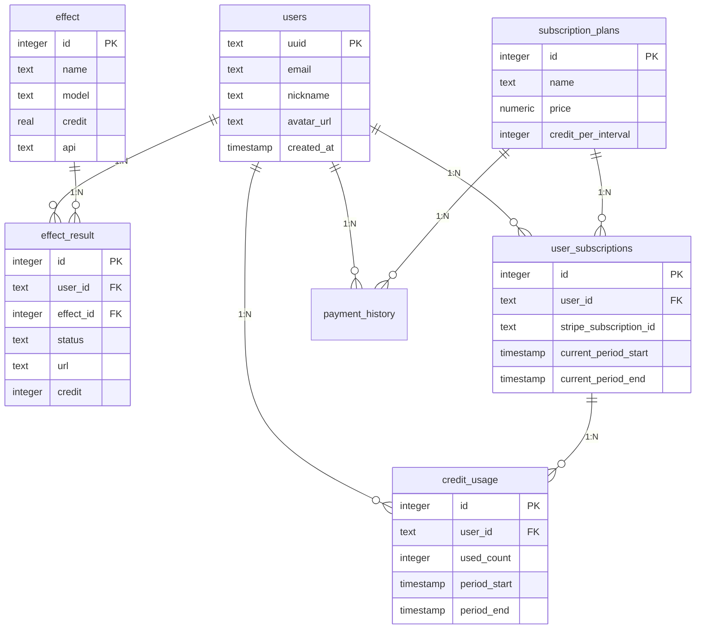

# AI图像视频生成项目代码结构分析报告

## 项目整体架构概览

这是一个基于 Next.js 14 的全栈 AI 图像视频生成应用，采用现代化的技术栈和分层架构设计。

### 技术栈
- **前端框架**: Next.js 14.2.11 (App Router)
- **开发语言**: TypeScript 5
- **样式框架**: Tailwind CSS 3.4 + NextUI/HeroUI
- **数据库**: PostgreSQL
- **身份验证**: NextAuth.js 4 (Google OAuth)
- **AI服务**: Replicate API
- **云存储**: AWS S3 / Cloudflare R2
- **支付系统**: Stripe
- **国际化**: next-intl

## 项目目录结构详细分析

### 📁 根目录配置文件
```
├── 📄 package.json              # 项目依赖和脚本配置
├── 📄 next.config.mjs            # Next.js 配置（图片优化、国际化）
├── 📄 tailwind.config.ts         # Tailwind CSS 配置
├── 📄 tsconfig.json              # TypeScript 配置
├── 📄 components.json            # shadcn/ui 组件配置
├── 📄 postcss.config.mjs         # PostCSS 配置
├── 📄 .env.production           # 生产环境变量
└── 📄 CLAUDE.md                  # Claude 开发指导文档
```

### 📁 src/app 目录 - Next.js App Router
```
src/app/
├── 📁 [locale]/                  # 国际化路由
│   ├── 📁 (free)/                # 公开页面路由组
│   │   ├── 📁 dashboard/         # 用户仪表板
│   │   ├── 📁 pricing/           # 定价页面
│   │   ├── 📁 text-to-image/     # 文字生成图像页面
│   │   ├── 📁 legal/             # 法律页面
│   │   ├── 📄 layout.tsx         # 公开页面布局
│   │   └── 📄 page.tsx           # 首页
│   ├── 📄 layout.tsx             # 本地化布局
│   └── 📄 providers.tsx          # 应用级Provider
├── 📁 api/                       # API 路由
│   ├── 📁 auth/[...nextauth]/    # NextAuth 认证
│   ├── 📁 webhook/               # Webhook 处理
│   │   ├── 📁 stripe/            # Stripe 支付回调
│   │   └── 📁 replicate/        # Replicate AI 回调
│   ├── 📁 predictions/           # AI 预测接口
│   │   ├── 📁 [id]/              # 预测状态查询
│   │   ├── 📁 img_to_video/      # 图像转视频
│   │   └── 📁 text_to_image/    # 文字生成图像
│   ├── 📁 effect_result/         # 生成结果管理
│   ├── 📁 r2/                   # 文件上传
│   ├── 📁 user/                 # 用户管理
│   └── 📁 checkout/             # 支付结算
├── 📄 layout.tsx                 # 根布局
├── 📄 globals.css               # 全局样式
└── 📄 middleware.ts             # 中间件（国际化处理）
```

### 📁 src/backend 目录 - 后端业务逻辑
```
src/backend/
├── 📁 config/                    # 配置文件
│   └── 📄 db.ts                  # 数据库连接配置
├── 📁 models/                    # 数据模型（数据库操作）
│   ├── 📄 user.ts                # 用户模型
│   ├── 📄 effect.ts              # AI效果模型
│   ├── 📄 effect_result.ts       # 生成结果模型
│   ├── 📄 credit_usage.ts        # 积分使用模型
│   ├── 📄 payment_history.ts     # 支付历史模型
│   ├── 📄 subscription_plan.ts    # 订阅计划模型
│   └── 📄 user_subscription.ts    # 用户订阅模型
├── 📁 service/                   # 业务逻辑服务
│   ├── 📄 user.ts                # 用户服务
│   ├── 📄 effect.ts              # AI效果服务
│   ├── 📄 effect_result.ts       # 生成结果服务
│   ├── 📄 credit_usage.ts        # 积分管理服务
│   ├── 📄 payment_history.ts     # 支付处理服务
│   ├── 📄 subscription_plan.ts    # 订阅计划服务
│   ├── 📄 user_subscription.ts    # 用户订阅服务
│   └── 📄 generate_check.ts       # 生成检查服务
├── 📁 lib/                       # 工具库
│   └── 📄 r2.ts                  # R2存储工具
├── 📁 type/                      # 类型定义
│   ├── 📁 domain/                # 领域类型
│   └── 📁 enum/                  # 枚举类型
├── 📁 utils/                     # 工具函数
└── 📁 sql/                       # SQL 脚本
    └── 📄 init.sql               # 数据库初始化脚本
```

### 📁 src/components 目录 - React 组件
```
src/components/
├── 📁 button/                    # 按钮组件
│   ├── 📄 delete-button.tsx      # 删除按钮
│   ├── 📄 login-button.tsx       # 登录按钮
│   └── 📄 user-button.tsx        # 用户按钮
├── 📁 landingpage/              # 落地页组件
│   ├── 📄 top.tsx                # 顶部横幅
│   ├── 📄 what.tsx               # 功能介绍
│   ├── 📄 how.tsx                # 使用说明
│   ├── 📄 feature.tsx            # 特性展示
│   ├── 📄 faq.tsx                # FAQ
│   ├── 📄 cta.tsx                # 行动召唤
│   ├── 📄 example.tsx            # 示例展示
│   └── 📄 credit-info.tsx        # 积分信息
├── 📁 layout/                    # 布局组件
│   ├── 📁 navbar/                # 导航栏
│   └── 📁 footer/                # 页脚
├── 📁 price/                     # 定价组件
│   ├── 📄 app.tsx                 # 定价应用
│   ├── 📄 pricing-tiers.tsx      # 定价层级
│   └── 📄 pricing-types.tsx      # 定价类型
├── 📁 replicate/                 # AI 生成组件
│   ├── 📁 common-logic/          # 公共逻辑
│   ├── 📁 img-to-video/          # 图像转视频
│   │   ├── 📄 worker-wraper.tsx  # 工作器包装器
│   │   └── 📄 worker.tsx          # 主要工作组件
│   └── 📁 text-to-image/         # 文字生成图像
│       ├── 📄 worker-wraper.tsx  # 工作器包装器
│       ├── 📄 worker.tsx          # 主要工作组件
│       └── 📄 img-output.tsx     # 图像输出组件
└── 📁 seo/                       # SEO 组件
    └── 📄 seo.tsx                 # SEO 元数据
```

### 📁 其他重要目录
```
src/
├── 📁 config/                    # 应用配置
│   └── 📄 colors.json             # 颜色配置
├── 📁 contexts/                  # React Context
│   ├── 📄 app.tsx                 # 应用上下文
│   └── 📄 theme.tsx               # 主题上下文
├── 📁 i18n/                      # 国际化配置
├── 📁 lib/                       # 工具库
├── 📁 providers/                 # 应用 Provider
├── 📁 types/                     # 全局类型定义
└── 📄 middleware.ts              # 应用中间件
```

## 核心功能逻辑关系

### 🔐 身份验证流程
```
Google OAuth → NextAuth.js → 用户数据存储 → Session管理
    ↓
用户信息写入users表 → 创建积分使用记录 → 返回JWT Token
```

### 💳 支付订阅流程
```
用户选择计划 → Stripe支付 → Webhook回调 → 更新订阅状态
    ↓
创建payment_history → 更新user_subscription → 分配积分到credit_usage
```

### 🤖 AI 生成流程
```
用户上传/输入 → 检查积分 → 调用Replicate API → 异步处理
    ↓
创建effect_result → Webhook更新结果 → 上传到R2存储 → 完成状态更新
```

### 📊 积分系统
```
订阅计划 → 积分分配 → 使用时扣除 → 周期性重置
    ↓
credit_usage表跟踪 → effect_result记录消耗 → 实时余额查询
```

## 数据库表关系图



## 关键技术特点

### 1. **分层架构**
- **表现层**: React组件 + Next.js页面
- **业务层**: Service层处理业务逻辑
- **数据层**: Model层处理数据库操作
- **集成层**: API路由处理外部服务

### 2. **异步处理**
- Replicate AI生成采用异步模式
- Webhook机制处理结果回调
- 队列化处理避免阻塞

### 3. **多租户设计**
- 基于用户的积分系统
- 订阅计划管理
- 权限控制和访问限制

### 4. **可扩展性**
- 模块化组件设计
- 配置化的AI效果管理
- 国际化支持

## 开发建议

### 代码组织
- 遵循分层架构，避免跨层调用
- 使用TypeScript严格类型检查
- 组件化开发，提高复用性

### 性能优化
- 使用Next.js图片优化
- 实现懒加载和代码分割
- 数据库查询优化

### 安全考虑
- 环境变量管理敏感信息
- API路由认证和授权
- 输入验证和SQL注入防护

这个项目展现了现代Web应用的最佳实践，具有良好的可维护性和扩展性。